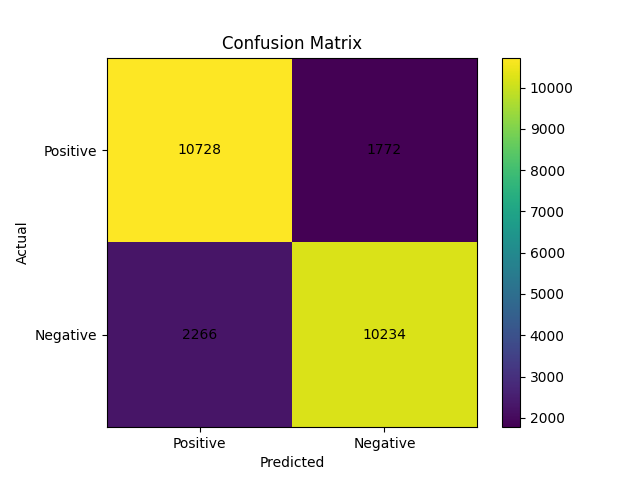
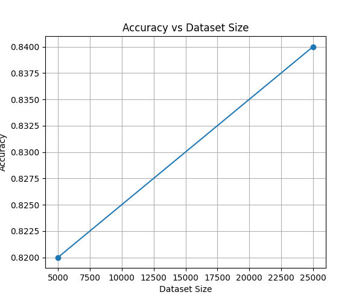

# 🎬 Sentiment Analysis on IMDb Movie Reviews

This project implements a complete **Natural Language Processing (NLP)** pipeline to classify movie reviews as **positive** or **negative** using machine learning techniques.

It uses the **IMDb Large Movie Review Dataset** and applies **TF-IDF vectorization** with a **Multinomial Naive Bayes** model to achieve strong classification performance.

---

## 🚀 Features

* Text preprocessing (tokenization, stopword removal, lemmatization)
* TF-IDF feature extraction
* Multinomial Naive Bayes classification
* Model evaluation using:

  * Accuracy
  * Precision
  * Recall
  * F1-score
* Confusion matrix visualization
* Dataset size vs accuracy analysis

---

## 🧠 Technologies Used

* Python
* NLTK
* Scikit-learn
* NumPy
* Matplotlib

---

## 📂 Project Structure

```
sentiment-analysis-imdb/
│
├── main.py              # Main NLP pipeline
├── matrix.py            # Confusion matrix visualization
├── acc_dsize.py         # Accuracy vs dataset size plot
├── README.md
├── requirements.txt
└── .gitignore
```

---

## 📊 Dataset

This project uses the **IMDb Large Movie Review Dataset**, which contains:

* 50,000 labeled reviews
* Balanced classes (positive & negative)
* 25,000 training samples
* 25,000 testing samples

🔗 Download dataset:
http://ai.stanford.edu/~amaas/data/sentiment/

---

## ⚙️ How to Run

### 1. Clone the repository

```bash
git clone https://github.com/chiarasupit/sentiment-analysis-imdb.git
cd sentiment-analysis-imdb
```

### 2. Install dependencies

```bash
pip install -r requirements.txt
```

### 3. Download dataset and set folder structure

```
data/
└── aclImdb/
    ├── train/
    └── test/
```

### 4. Update dataset path in `main.py`

```python
train_path = "data/aclImdb/train"
test_path = "data/aclImdb/test"
```

### 5. Run the project

```bash
python main.py
```

---

## 📈 Results

The model achieves strong performance:

* Accuracy: **0.88**
* Precision: **0.87**
* Recall: **0.89**
* F1-score: **0.88**

---

## 📉 Visualizations

### Confusion Matrix

(Add your image here after uploading)

```

```

### Accuracy vs Dataset Size

(Add your image here after uploading)

```

```

---

## 🔮 Future Improvements

* Implement deep learning models (LSTM, BERT)
* Improve handling of sarcasm and mixed sentiment
* Add web interface using Streamlit
* Extend to multi-class sentiment classification

---

## 👤 Author

**Chiara Supit**
B.Sc. in Applied Artificial Intelligence
IU International University of Applied Sciences

---

## 📌 License

This project is for academic and educational purposes.
